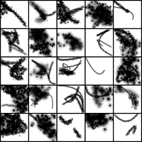
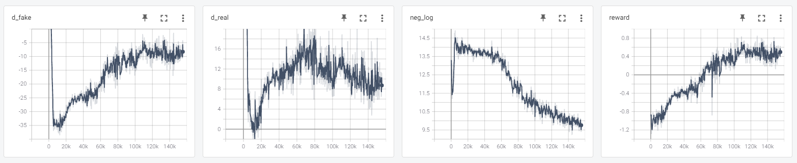

# spiral_pytorch_ray
 The original spiral paper (https://arxiv.org/abs/1804.01118) training pipeline implementation in pytorch and ray

## Requirements:
2 GPUs. One for policy learning and one for discriminator learning. \
\
Note that this training pipeline is for a single machine. Population-based exploration of hyperparameters (PBT) is not implemented.

## Usage: 
1. Install https://github.com/deepmind/spiral following the instructions (need the libmypaint environment)
2. Copy all python scripts here to spiral/
3. Download some data. Look at real_image_loader.py for dataset location/format
4. Adjust hyperparameters in config.py
5. Run **python spiral_torch.py**

 

15000 policy training steps on digit 4 in mnist (each training step is n_batches * n_timesteps, or 64*10):

 

 

 

 

## Possible differences from the original paper
1. In the original paper, discriminator trains faster than policy because of network structure. \
However in this implementation, discriminator trains faster because policy spends most of the time waiting for batches from painter agents.
2. Policy trains on each trajectory for only once (which causes 1.) to be on-policy. But in the paper, they describe the training as off-policy.

## Also credit to:
1. https://github.com/werner-duvaud/muzero-general. I learned about ray here.
2. https://github.com/eriklindernoren/PyTorch-GAN/blob/master/implementations/wgan_gp/wgan_gp.py. I used the wgan-gp implementation here.
